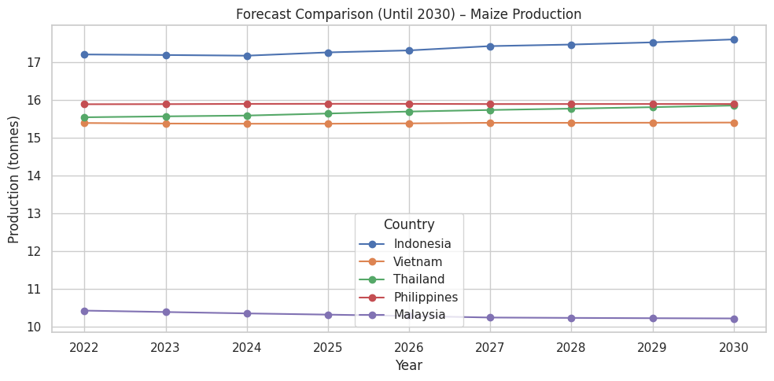
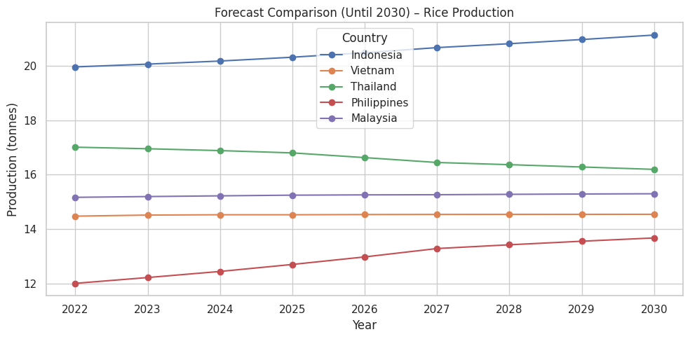
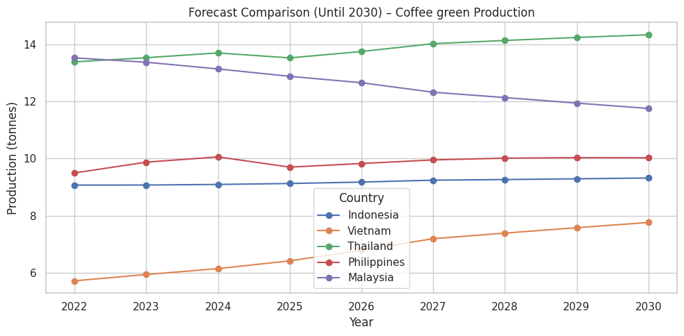
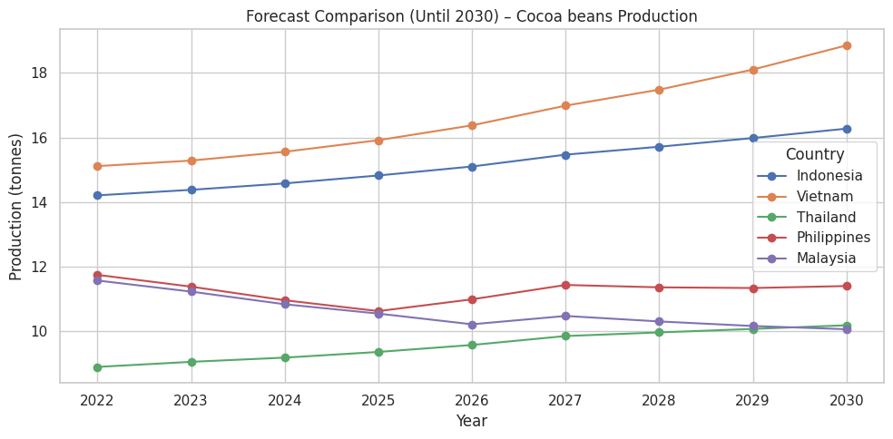
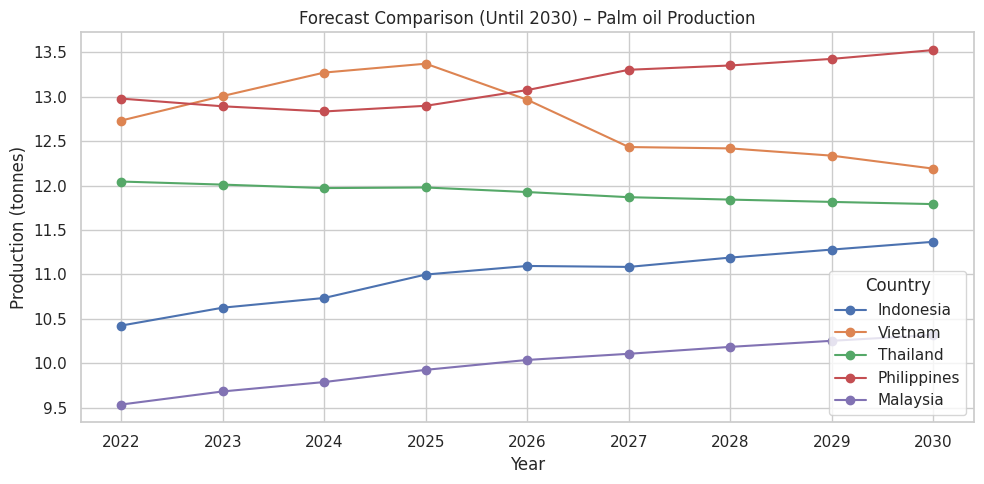

# Laporan Proyek Machine Learning - Fadhilah Nurrahmayanti

## Domain Proyek

Produksi pangan merupakan sektor vital bagi negara-negara ASEAN, mengingat sebagian besar wilayahnya masih mengandalkan pertanian sebagai sumber utama pangan dan pendapatan. Dengan meningkatnya populasi dan perubahan iklim yang tidak menentu, memprediksi produksi pangan menjadi kebutuhan strategis. Data historis produksi komoditas seperti padi, jagung, kelapa sawit, kakao, dan kopi dapat dimanfaatkan untuk membuat prediksi produksi di masa depan.

Proyek ini bertujuan membangun model machine learning berbasis LSTM untuk memprediksi produksi komoditas-komoditas penting tersebut di beberapa negara ASEAN hingga tahun 2030.

## Business Understanding

### Problem Statements

1. Tren produksi komoditas pertanian di ASEAN sangat fluktuatif dan tidak menentu dari tahun ke tahun.
2. Belum ada standar prediksi terstruktur untuk membandingkan posisi produksi Indonesia terhadap negara ASEAN lainnya.
3. Metode statistik konvensional (regresi linear, moving average) kurang mampu menangkap pola musiman dan nonlinier yang kompleks.

### Goals

1. Mengembangkan model prediksi produksi menggunakan LSTM univariat berdasarkan histori data produksi (1961–2023).
2. Membandingkan hasil prediksi tahun 2022–2030 antar negara ASEAN untuk tiap komoditas.
3. Menunjukkan keunggulan LSTM dibanding metode tradisional dalam menangkap pola waktu musiman.

### Solution Statements

* Melatih 25 model LSTM univariat (5 negara × 5 komoditas).
* Evaluasi performa model dilakukan menggunakan **MSE** dan **RMSE**.
* Menyediakan visualisasi tren dan hasil prediksi dalam grafik garis dan batang.

## Data Understanding

File data bernama `Data.csv` yang merupakan dataset [World Food Production Dataset (Kaggle)](https://www.kaggle.com/datasets/rafsunahmad/world-food-production/data) dan berisi 11.912 baris dengan 24 kolom. Dataset yang digunakan berisi data produksi komoditas pangan dari berbagai komoditas (dalam ton) dari tahun 1961 hingga 2023, mencakup lebih dari 160 negara. 

### Fitur penting pada dataset:

* `Entity`: Negara (Indonesia, Malaysia, Vietnam, Thailand dan Filipina.)
* `Item`: Komoditas (Rice, Maize, Coffee, green, Cocoa Beans, Palm Oil)
* `Year`: Tahun produksi
* `Value`: Jumlah produksi (dalam metrik ton)

### Visualisasi awal:

* Menggunakan `matplotlib` dan `seaborn` untuk melihat tren tahunan
* Plot tren produksi per negara dan komoditas menunjukkan pola musiman dan fluktuatif

## Data Preparation

### Langkah-langkah yang dilakukan:

1. **Penyaringan Data**: Memilih data dari negara ASEAN dan 5 komoditas utama.
2. **Encoding**: Label encoding pada fitur kategorikal seperti negara dan komoditas.
3. **Transformasi**: Menggunakan transformasi logaritmik pada kolom `Value` untuk mengurangi outlier ekstrem.
4. **Normalisasi**: Menggunakan `MinMaxScaler` agar nilai berada pada rentang 0-1.
5. **Sequence Generation**: Membentuk data menjadi time series sequence untuk input LSTM.
6. **Split Data**: Data dibagi menjadi train dan test dengan proporsi 80:20.

## Modeling

### Model yang digunakan: **LSTM (Long Short-Term Memory)**

* **Arsitektur:**

  * 2 lapisan LSTM (masing-masing dengan 50 unit)
  * 1 lapisan Dense (output)
* **Optimizer:** Adam
* **Loss function:** Mean Squared Error (MSE)
* **EarlyStopping:** digunakan dengan `patience=10` untuk mencegah overfitting

### Proses training:

* Epoch hingga 100, dengan early stopping aktif
* Batch size: 16

### Evaluasi model dilakukan pada setiap kombinasi Negara-Komoditas, contoh:

* **Indonesia - Rice**: RMSE = 0.189
* **Vietnam - Coffee, green**: RMSE = 1.231
* **Malaysia - Cocoa Beans**: RMSE = 2.936
* **Philippines - Maize**: RMSE = 0.037

## Evaluation

### Metrik yang digunakan:

* **Mean Squared Error (MSE)**: Mengukur rata-rata kuadrat selisih antara prediksi dan aktual.
* **Root Mean Squared Error (RMSE)**: Mengukur kesalahan dalam satuan asli (ton).

$$
\text{RMSE} = \sqrt{\frac{1}{n}\sum_{i=1}^{n}(y_i - \hat{y}_i)^2}
$$

### Hasil evaluasi:

* Komoditas seperti jagung dan beras memiliki akurasi tinggi.
* Prediksi untuk kopi dan kakao masih memiliki RMSE cukup tinggi, yang menandakan perlu penyempurnaan model di masa mendatang.

### Visualisasi:

* Grafik prediksi vs aktual untuk tiap negara dan komoditas
* Prediksi produksi hingga tahun 2030 menunjukkan tren naik pada komoditas seperti beras dan kopi di beberapa negara

## Hasil Prediksi

Proyek ini memprediksi produksi jagung, beras, kopi, kakao dan kelapa sawit dari tahun **2022 hingga 2030** untuk empat negara utama ASEAN. Berikut adalah hasil utama dari prediksi tersebut:

### Maize Production

### Rice Production

### Coffee Green Production

### Cocoa beans Production

### Palm Oil Production

Prediksi ini memberikan wawasan penting bagi pengambil kebijakan dan pelaku industri untuk merencanakan strategi pertanian dan mengantisipasi tren produksi lintas negara ASEAN.

---

## Referensi

1. [World Food Production Dataset (Kaggle)](https://www.kaggle.com/datasets/rafsunahmad/world-food-production/data)
2. [ML Models: Food Security and Climate Change](https://link.springer.com/chapter/10.1007/978-3-031-08743-1_6)
3. [Predicting Agricultural Commodities with Machine Learning](https://arxiv.org/abs/2310.18646)
4. Food and Agriculture Organization (FAO). (2023). *World Food and Agriculture Statistical Yearbook*. [https://www.fao.org](https://www.fao.org)
5. World Bank. (2022). *Agricultural Indicators*. [https://data.worldbank.org](https://data.worldbank.org)
